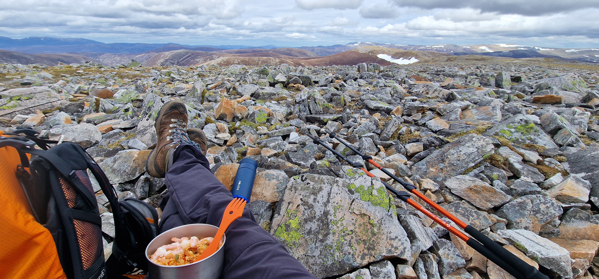
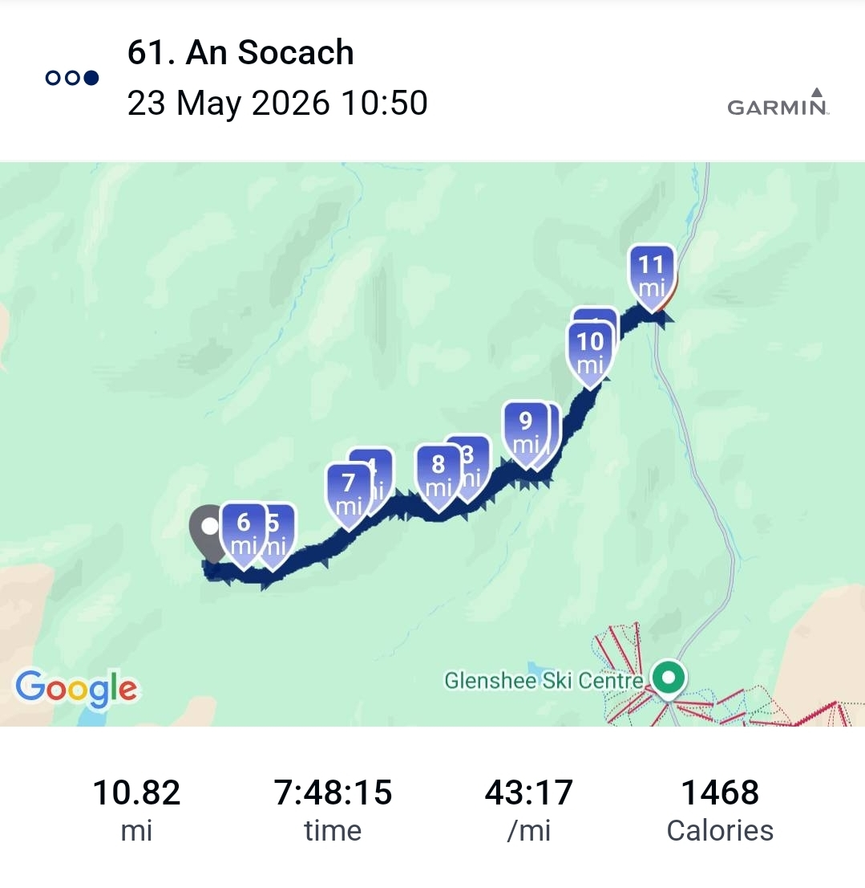

# An Socach (Braemar)

> nice quiet space with dicey moments...

---

## Details

| Field | Value |
|-------|-------|
| Date completed | 2026-05-23 |
| Completion number | 61 |
| Weather | sun/cloud |
| Rating | 7 / 10 |
| Companions | solo |

---

## Notes

* forecast was wind but decided to go anyway
* overnighter in Blairgowrie outskirts attic flat - nice dinner and granola breakfast to set me up
* oh so steep coming down - thankfully did not slide uncontrollably on my backside on the heather .. not as near death as the last one though
* quiet moment in valley listening to the river and the rain on my waterproof - then the birds!
* saw lovely hare at end in valley
* wind wasn't so bad in the end .. slightly blowy and glad of the cairn shelter for a spot of lunch but nothing to unsteady things
---

## The Moment

<A short moment from the day>

---

## Photos

### Route

