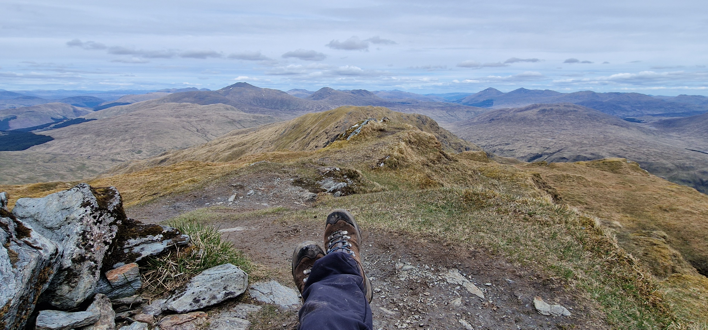
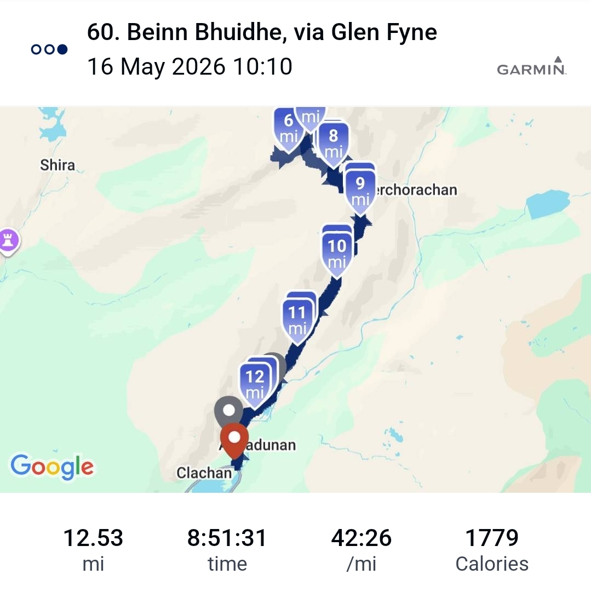

# Beinn Bhuidhe

> thankful for God's steering away from death

---

## Details

| Field | Value |
|-------|-------|
| Date completed | 2026-05-16 |
| Completion number | 60 |
| Weather | cloud sun |
| Rating | 6 / 10 |
| Companions | Stuart |

---

## Notes

* precarious ledges... hum
* sheer rock-faces seemingly - one slip..
* short lunch just above death face but thankfully couple skipped past the path of death inspiring us to realise there is an alternate path - prayer answered!
* threatening rain that did not materialise thankfully
* bit too nervous to fully appreciate summit with anticipation of death path descent..
* amazing burger+chips tea in Arrocher sat outside under parasol, slight spitting rain and Cobbler - good shout, Stuart!

---

## The Moment

Passed a life death moment with Stuart 

---

## Photos

### Route

