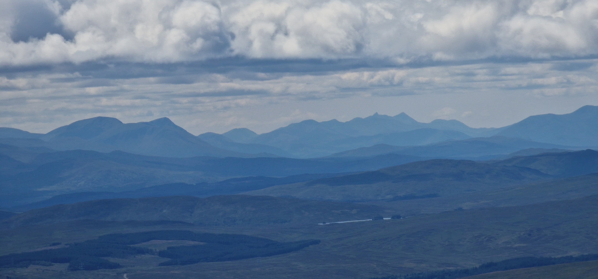
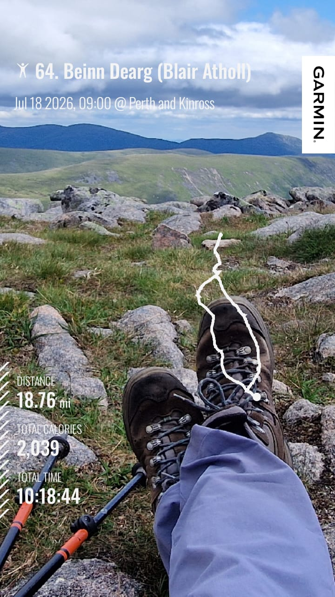
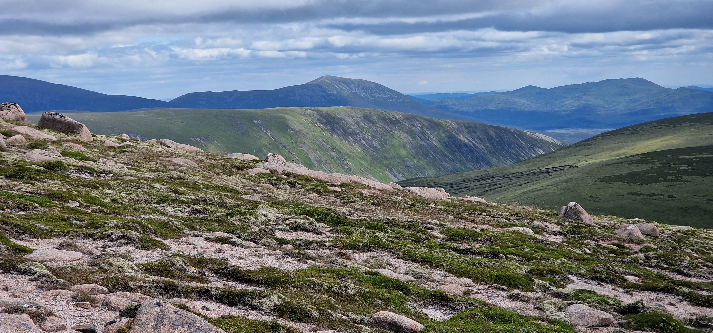
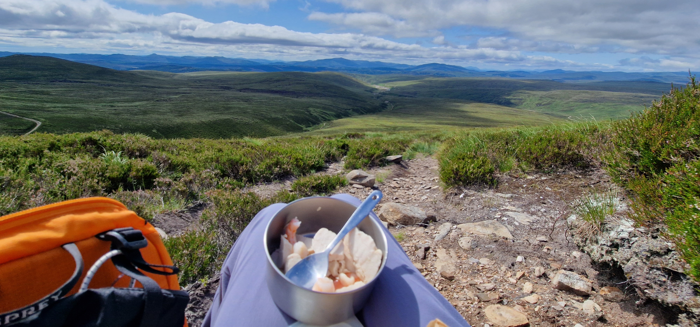

# Beinn Dearg (Blair Atholl)

> longest walk ever with planned in lunch 1, 2, 3 ..

---

## Details

| Field | Value |
|-------|-------|
| Date completed | 2026-07-18 |
| Completion number | 64 |
| Weather | sunny, hot, spitting, cloudy |
| Rating | 7 / 10 |
| Companions | Stuart |

---

## Notes

* longest walk ever
* unhappy knees..
* chosen for the civilised notion of a path after the previous drama
* first glove/fleece/waterproof in a while amidst the Scottish heatwave
* Cairngorm fires - seen some darker, unusually drifting clouds

---

## The Moment

Heather is in! 

Sillhouetted ranges are in! 

Thankful I can still do 18+ mile walk! :pray:

---

## Photos

### Route

### Highlights

