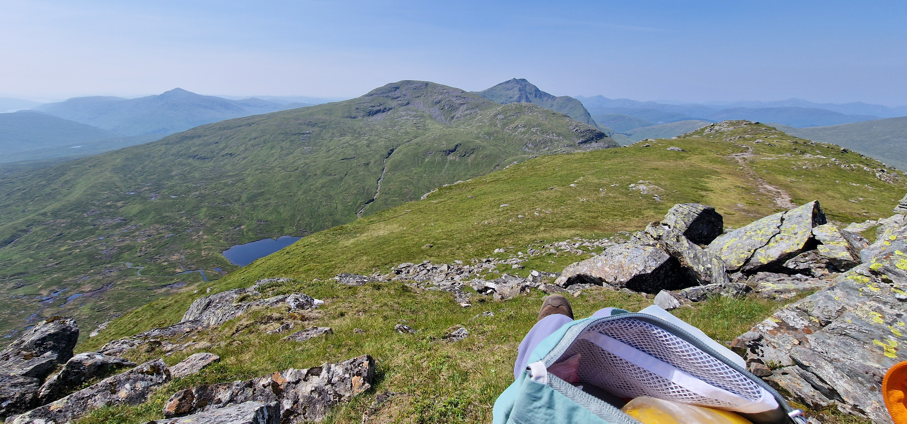
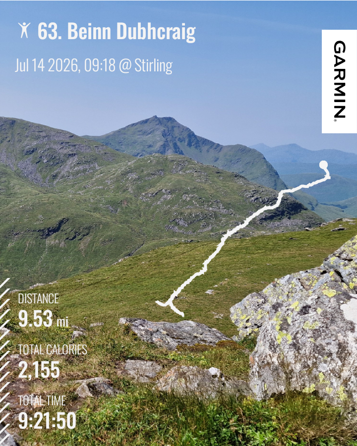
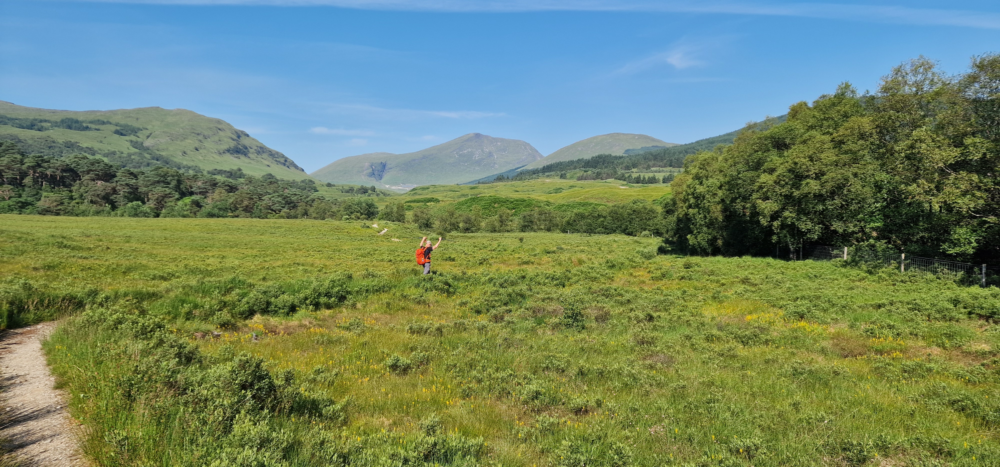
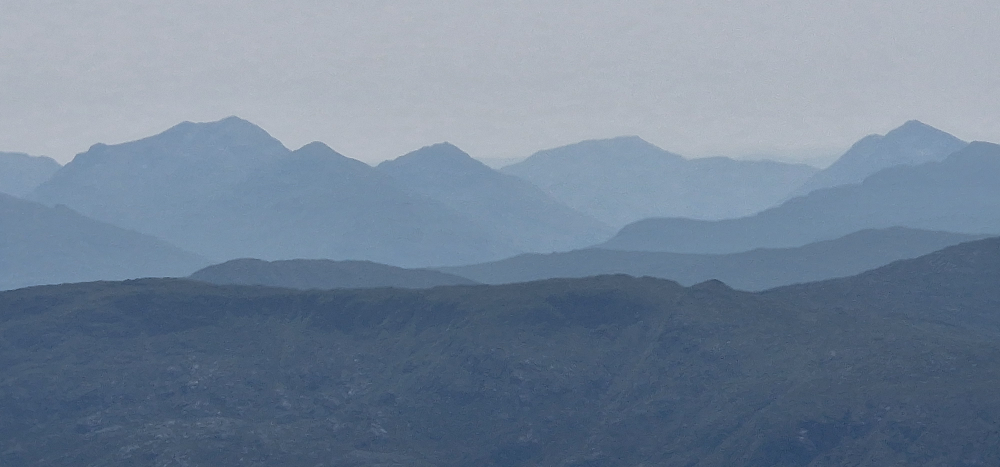
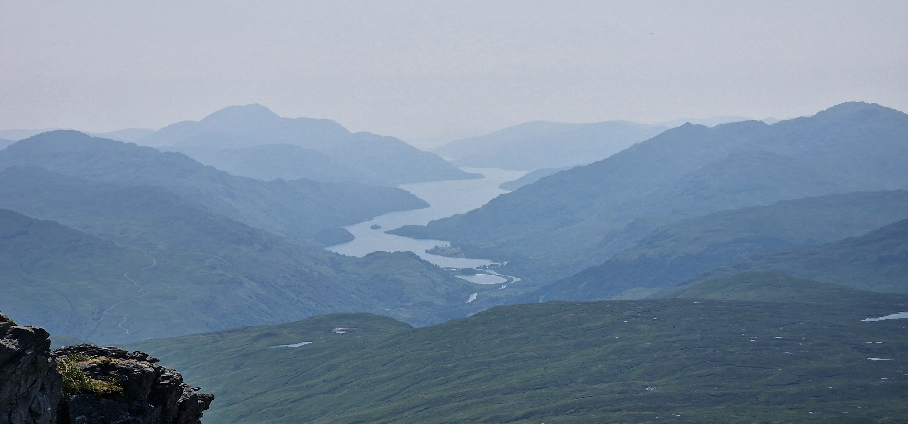

# Beinn Dubhchraig,tbd

> pretty but hard - how heroic!

---

## Details

| Field | Value |
|-------|-------|
| Date completed | 2026-07-14 |
| Completion number | 63 |
| Weather | hot and sunny |
| Rating | 6 / 10 |
| Companions | Darryl |

---

## Notes

After much pondering - considering hours available and the heat - it was decided that Creag Meggaidh be aborted in favour of a closer and boggier walk to Beinn Dubhcraig. Given the semi-heatwave, the bogs would hopefully be dried up!

An overnighter in Callander - bright early start following light granola/Kefir brekkie.
I forgot my flask of tea sat on kitchen bench! 😢

Clammy, buggy ~~woods~~ jungle - just about held onto consciousness.
Narrow path dropping into chasm of ferns.

Spectacular 360 at the top - found a lovely spot out of the wind - just perfect. 
Looking towards Loch Lomond - the view just opened on the summit!
Bit of exploration to Ben Oss to check future feasibility.. maybe .. maybe not...

Return felt bit more boggy but got lovely relieve with a cooldown feet dip in the river.
.. in preparation for knee high bog incident, near miss off the afore-mentioned chasm of ferns edge

At summit point - this was 8/10 .. eventually dropping down to 6.
Not sure will be back for Ben Oss...

Lesson 1: make checklist so not to forget tea!
Lesson 2: no more bog factor 4 pathless walks

---

## The Moment

Heatstroke, bogs, rubble.

Pretty rocks, spectacular Ben Lui, calm Loch Lomond, summit lochans.

---

## Photos

### Route

### Highlights

