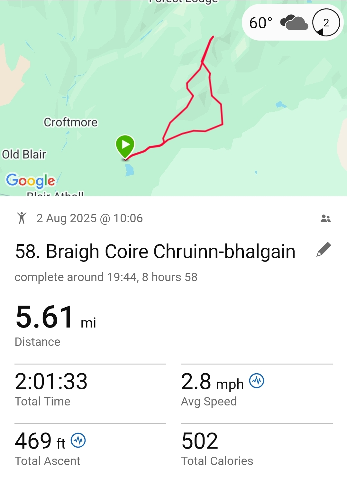

# Bràigh Coire Chruinn-bhalgain

> priceless moments

---

## Details

| Field | Value |
|-------|-------|
| Date completed | 2025-08-02 |
| Completion number | 58 |
| Weather | sunny |
| Rating | 10 / 10 |
| Companions | Stuart, Dominique |

---

## Notes

* vast, open space - priceless
* long chill time at top - deciding to come back next year to do the final Beinn a Ghlo! - must go more loitering 
* dodge students? - stayed safe
* stats messed up: Garmin considered speed too slow to be worth tracking
* completed the day with a nice Vietnamese in town

---

## The Moment

I love the hills but so happy for Dominique to have had the super-hill-joy moment!

---

## Photos

### Route

