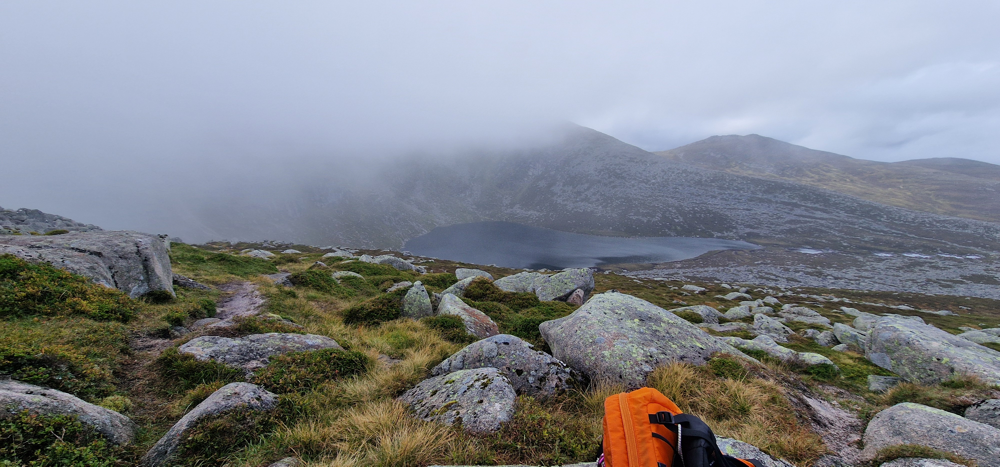

# Càrn a' Choire Bhòidheach

> Into the Misty mountains

---

## Details

| Field | Value |
|-------|-------|
| Date completed | 2026-09-02 |
| Completion number | 66 |
| Weather | nothing to see |
| Rating | 4 / 10 |
| Companions | solo |

---

## Notes

... from [Lochnagar](../munros/lochnagar.md) 

Done with encouragement from passing walker noting there's not much to see on this one. Why not just tick it off if it is a stone's throw away!

Thankfully wind was not as weather suggested. Rain was on and off. Mist was permanantly on.

After a brief stop to note there was nothing to see, it was a quick head back. It was a short drive of 20 minutes back to the accomodation but still worrying about the rocky slabs and picking out the path. 

Trying to bound down quickly intentionally using my ankles more to control descent as an experiment. Seem to work nicely. Bit slow on the slab descent and some rocky bits.

Back at the bealach at the bottom of the slabs the sun tried to come out! 

It was gone before the picnic was fully out. So off it was again to beat the sunset.

Plan: How will I complete the remaining 3 White Mounth Munros? Two more trips - Broadcairn+1 from Loch Muick and Càrn an t-Sagairt Mòr from Auchallater. 

Note to self: 1. It is worth getting up early for a mountain view! 2. Don't take short cuts into the mist! 3. Two hours to bealach to the corrie and before the slabs - maybe worth short stroll - maybe up Meikle Pap!

---

## The Moment

Mist down. Nothing to see. My first munro with no view?

---

## Photos

### Route

