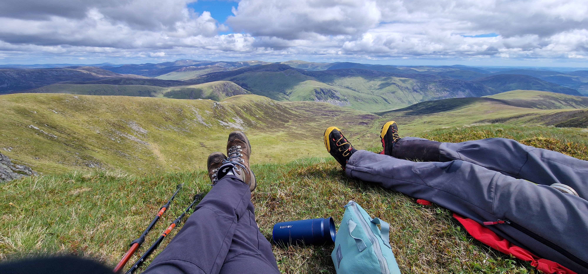
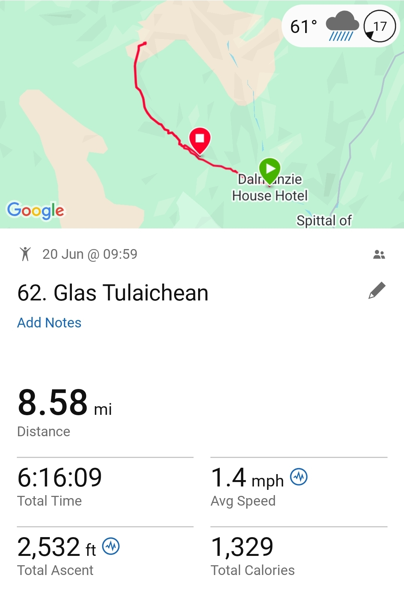

# Glas Tulaichean

> Munro #62 completed on 2026-05-20

---

## Details

| Field | Value |
|-------|-------|
| Date completed | 2026-05-20 |
| Completion number | 62 |
| Weather | sunny, cloudy, windy |
| Rating | 9 / 10 |
| Companions | Darryl |

---

## Notes

* first river wade! (and 2nd) - finally got to reuse Budapest water shoes
* the track of many fords vs not-so-boggy-old railway track
* skipping barbed wire fence under the watch of sheep skull
* t-shirt to woolly hat/gloves/fleece/waterproof day!
* just as track gets a bit tedious, the spectacular views open up at the top! Amazing shapes, endless hilltops near and far!
* nothing like finishing the day with cream scone and tea watching red squirrel hide nuts and rabbits eating grass
* a week of weather sceptism crystallising into a spectacular day .. lesson: Just go out!
* £5 for day's parking at the Castle Dalmunzies hotel - not bad .. with 10% off tea and cake after

---

## The Moment

Fords, Summit lunches, red squirrels - amazing day .. too many moments!

---

## Photos

### Route

