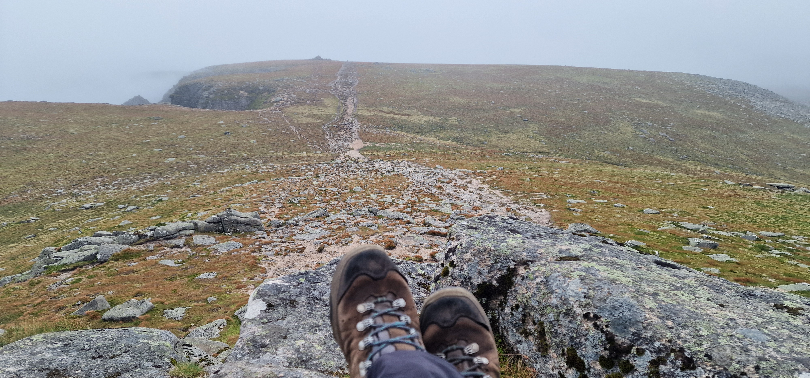
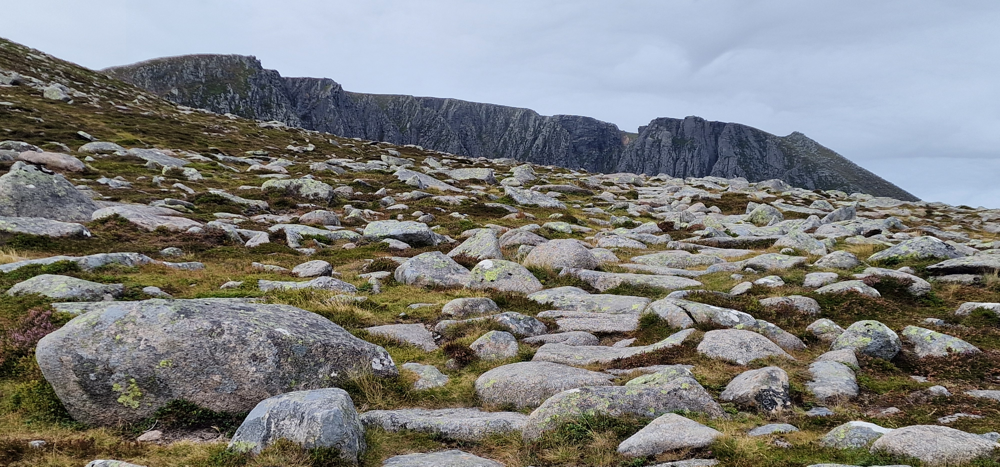
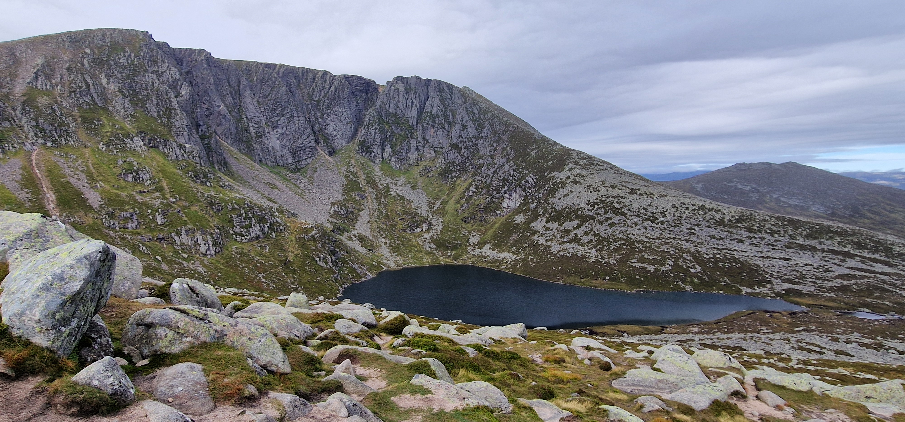
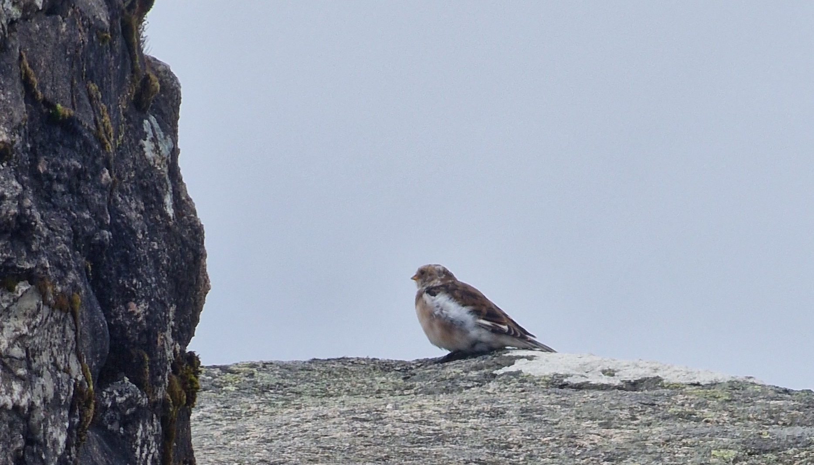
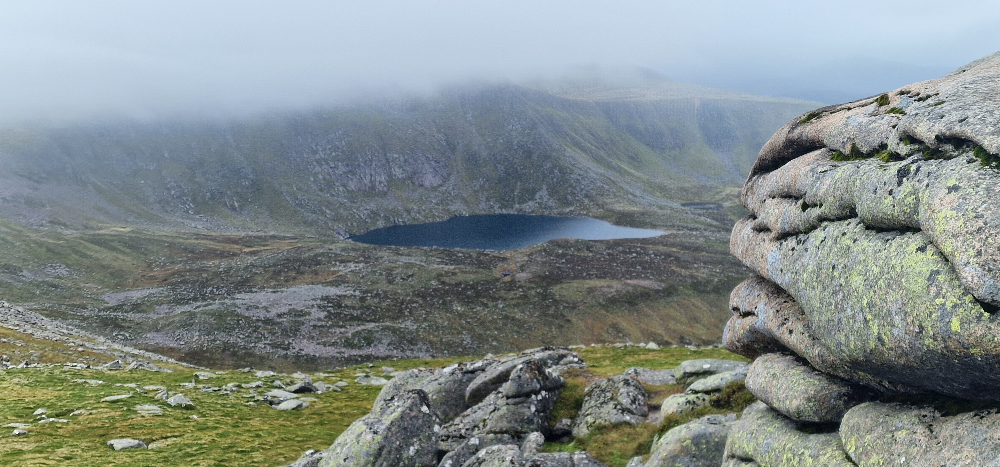
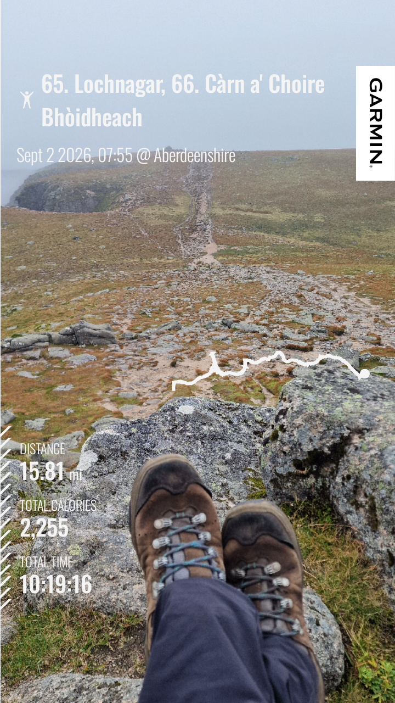

# Lochnagar

> The Majestic Corrie .. is but a pale comparison! -- "The whole earth is filled with awe at your wonders; where morning dawns, where evening fades, you call forth songs of joy." (Psalm 65:8)

---

## Details

| Field | Value |
|-------|-------|
| Date completed | 2026-09-02 |
| Completion number | 65 |
| Weather | brief sun but mostly claggy |
| Rating | 8 / 10 |
| Companions | solo |

---

## Notes

Despite the mostly claggy day, the view of Lochnagar is just priceless!

After years of consideration, I finally decided to take a week in Ballater in hope to do part of the White Mounth group. After some deliberation, it seemed a good idea to go for short dry spell with risk of cloud to avoid 40mph winds the following day.

After a late start despite plans to catch the early good weather, my first encounter was a fast moving mammal darting into the bush! Wildcat maybe?

Sun was out. Glimpses of what I later realised was the Lochnagar crags was seen. 

Along a well made path with hardly anyone around, the reward of the tops of the crags was eventually seen which opened up into the spectacular corrie! 

Much as I knew it was a race against the weather, a walk to the edge was too much of a draw. It would be the best view of the day!

After much dithering, it was time to go up the steep side I had read much about. I must have lost the path because it started looking hairy. God must have sent these walkers at that time to lead the way to what they thought was an 'obvious well tread path'. Going up, all the way wondering whether to come back the same way. Big slabs although with concentration, it seemed carefully lined up to form a human path. The alternative was apparently a terrible option particularly in wet weather down a steep grassy path. Hum. 

Clouds were gathering. Speed had to be picked up. Big cairn passed. Turns out it's not it. Another big cairn. Seemed like Sauchiehall Street after the quiet path up! Shrouded in cloud that drifted in and out.

Lunch in the sheltered spot. Two walkers spotted a 'snow bunting' - little bird - which distracted from what I later realised was a brief clearance to see the view to Loch nan Eun and perhaps the next munro.

The review of the next munro by other walker was that it is uneventful and not impressive. Given this information, it seemed a good idea to get this ticked off so I can focus on the southern White Mounth in my next trip up. 

Food packed. Mist down. Waterproof out. Gloves out. Into the cloud, eyes on the OS map app. A wrong turn meant going down the return track. Lost some 10 minutes trying to cut through the land off piste to back track. Still seemed viable to head to the second munro! ..

.... to [Càrn a' Choire Bhòidheach](../munros/carn-a-choire-bhoidheach.md)

---

## The Moment

awe struck moment of seeing the top of the crags and the opening up of Lochnagar on the approach! ..

---

## Photos

### Route

